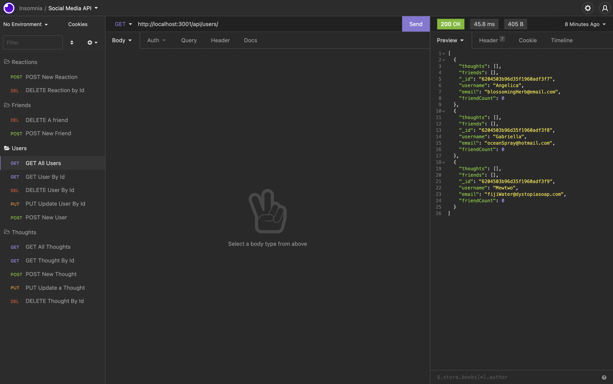

# social-media-api MIT 
  ## Description
  The motivation for this project was to utilize MongoDB with Mongoose. This application can find, create, update and delete Users and Thoughts created by Users. It can also add friends to Users and Reactions to Thoughts. I learned how to navigate throught the MongoDB, modularize routes and controllers, connect my server to my Mongo Database and performed CRUD operations using Mongoose.

  ## Table of Contents
  - [Installation](#installation)
  - [Usage](#usage)
  - [Credits](#credits)
  - [License](#license)
  
  ## Installation
  Run in terminal:
  
  * node utils/seed.js 
  * node server.js

  ## Usage

  

  [Link to Video](https://drive.google.com/file/d/1yMK4r8R4yrf5IVxSux9LzfVVd13MGXjY/view?usp=sharing)
  
  ## Credits
  Not applicable

  ## License
  

  Copyright 2022 Tina Stanczyk

  Permission is hereby granted, free of charge, to any person obtaining a copy of this software and associated documentation files (the "Software"), to deal in the Software without restriction, including without limitation the rights to use, copy, modify, merge, publish, distribute, sublicense, and/or sell copies of the Software, and to permit persons to whom the Software is furnished to do so, subject to the following conditions:
  
  The above copyright notice and this permission notice shall be included in all copies or substantial portions of the Software.
  
  THE SOFTWARE IS PROVIDED "AS IS", WITHOUT WARRANTY OF ANY KIND, EXPRESS OR IMPLIED, INCLUDING BUT NOT LIMITED TO THE WARRANTIES OF MERCHANTABILITY, FITNESS FOR A PARTICULAR PURPOSE AND NONINFRINGEMENT. IN NO EVENT SHALL THE AUTHORS OR COPYRIGHT HOLDERS BE LIABLE FOR ANY CLAIM, DAMAGES OR OTHER LIABILITY, WHETHER IN AN ACTION OF CONTRACT, TORT OR OTHERWISE, ARISING FROM, OUT OF OR IN CONNECTION WITH THE SOFTWARE OR THE USE OR OTHER DEALINGS IN THE SOFTWARE.
  
  

  https://opensource.org/licenses/MIT

  ## Badges
  Not applicable

  ## Features
  Not applicable

  ## How to Contribute
  Invest in further development for this application

  ## Tests
  Testing done through insomnia

  ## Questions
  Contact me here if you have further questions: 

  Email - t9.stanczyk@gmail.com 

  Github - https://github.com/tinastanczyk 

